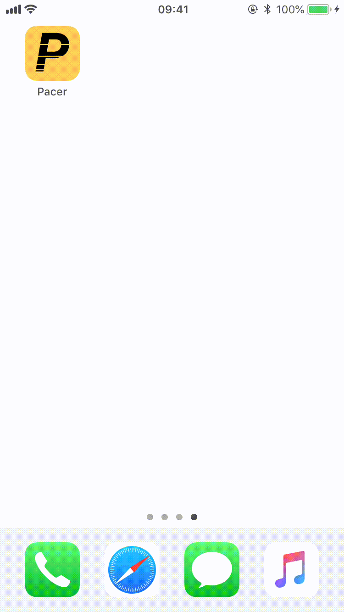

# Pacer - A pacer converting iOS App 
--------------
A simple iOS app written in Swift that allows you to easily convert between minute per mile pace and minute per kilometre pace. 
Just select your measuring system and your minutes and seconds. 

  

